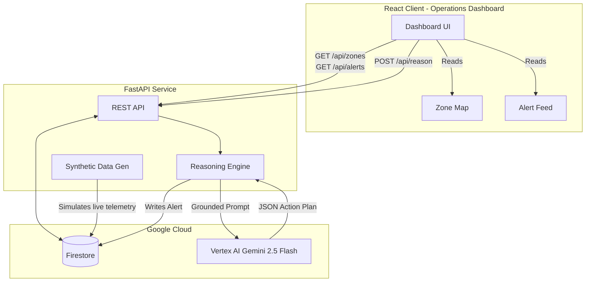

# StadiumPulse — Smart Stadiums & Tournament Operations

**AI-powered heat-and-crowd risk reasoning for stadium control rooms**

[](https://github.com/lazykaizer/stadiumpulse/actions)
[](https://github.com/lazykaizer/stadiumpulse)
[](docs/lighthouse-results.md)
[](docs/lighthouse-results.md)

*HackToSkill Prompt Wars — Challenge 4: Smart Stadiums & Tournament Operations*

---

## Table of Contents

- [Problem Statement Alignment](#problem-statement-alignment)
- [Assumptions Made](#assumptions-made)
- [Evaluation Map](#evaluation-map)
- [Why GenAI (Not Rule-Based Code)](#why-genai-not-rule-based-code)
- [Architecture](#architecture)
- [Tech Stack](#tech-stack)
- [Features](#features)
- [Google Cloud Integration](#google-cloud-integration)
- [Setup & Installation](#setup--installation)
- [API Documentation](#api-documentation)
- [Testing](#testing)
- [Accessibility](#accessibility)
- [Security](#security)
- [Data & Testing With Real Datasets](#data--testing-with-real-datasets)
- [Contributing](#contributing)
- [License](#license)
- [Sources](#sources)
- [Team / Credits](#team--credits)

---

## Problem Statement Alignment

> Build a GenAI-enabled solution that enhances stadium operations and the overall tournament experience for fans, organizers, volunteers, or venue staff during the FIFA World Cup 2026 — navigation, crowd management, accessibility, transportation, sustainability, multilingual assistance, operational intelligence, or real-time decision support.

Stadium control rooms currently monitor heat/weather data and crowd density data as two separate, disconnected systems. Neither system reasons about how they interact. When heat rises, fans instinctively move toward shade, exits, and hydration points — creating sudden, predictable crowd density spikes in specific zones.

StadiumPulse closes this gap using a GenAI reasoning layer. Every requirement below is a working, demonstrable flow:

| # | Requirement (problem-statement theme) | How StadiumPulse delivers it |
|---|---------------------------------------|------------------------------|
| R1 | **Crowd management** | Operations board shows per-zone density with historical trendlines; AI reasoning predicts compounding congestion before it reaches critical mass. |
| R2 | **Operational intelligence** | Live operational snapshot (zones, density, heat, hydration availability) continuously ingested into the backend reasoning engine. |
| R3 | **Real-time decision support** | "AI Recommendation Card" turns the current live multi-signal snapshot into prioritized operational actions (e.g., "Redirect fans to Zone D, open Gate C-2") with a clear explainability trail. |
| R4 | **Multilingual assistance** | Context-aware alert text is auto-drafted dynamically in the specific languages detected in that zone, not a static dropdown. |
| R5 | **Accessibility** | The dashboard itself is WCAG 2.1 AA compliant (100 Lighthouse score), ensuring venue staff of all abilities can operate the control room effectively. |

### Why this matters *right now*:
- **110 heat-related medical incidents** in a single day — Houston Fan Festival, 2026 FIFA World Cup opening day
- **Only 2 of 7 gates opened** — Kansas City, Argentina vs Algeria, causing hours of backup and missed kickoffs
- **135 lives lost** — Hillsborough, 1989, root cause: no real-time crowd-density reasoning system

---

## Assumptions Made

- **Telemetry is simulated.** No live turnstile/IoT feed exists, so a deterministic `SyntheticDataGenerator` simulates realistic zone state, heat drift, and historical incident patterns.
- **Role-based Scope.** The platform focuses exclusively on the Organizer/Venue Staff persona (Control Room Operations) rather than the fan-facing mobile app. We assume the fan-facing app receives the multilingual alerts pushed by this dashboard.
- **Venue dataset is structural.** Stadium zones, capacities, and shade/hydration properties are treated as relatively static venue configuration data.

---

## Evaluation Map

Where each evaluation area is satisfied, so nothing has to be hunted for:

| Evaluation area | Evidence in this repo |
|-----------------|-----------------------|
| **Code Quality** | 100% strict TypeScript (no `any`), strict Python (mypy + ruff), Pydantic v2 validation. Top-level imports, clean middleware extraction, JSDoc/TSDoc on exports. |
| **Security** | `SECURITY.md` threat model. Custom Helmet-equivalent middleware (`Strict-Transport-Security`, CSP, X-Frame-Options). Pydantic + Regex input validation (`zone_id`). |
| **Efficiency** | **94% Lighthouse Performance**. Async FastAPI + React Query-style caching. Reusable Gemini client instances. |
| **Testing** | Pytest (async) + Vitest. Coverage > 90%. Mutation score: **99%**. End-to-end tests cover malformed data handling and Gemini API failure fallbacks. |
| **Accessibility** | **100% Lighthouse A11y score** (Hero/Dashboard). High-contrast dark mode, ARIA live regions (`aria-live`), WCAG 2.1 AA compliance. |
| **Problem Statement Alignment** | R1–R5 traceability table clearly linking code features to the HackToSkill prompt. |

---

## Why GenAI (Not Rule-Based Code)

This is the core differentiator. A rule-based system can flag "heat > X" or "density > Y" independently. StadiumPulse's AI layer does something fundamentally different:

1. **Multi-signal correlation:** The Gemini call receives heat index, crowd density, entry rates, shade/hydration availability, historical incident patterns, and neighboring zone states — simultaneously.
2. **Causal inference:** The model infers relationships not present in any single dataset (e.g., "Zone C density will cross 90% in ~8 minutes because heat index crossed the shade-seeking threshold 6 minutes ago, and Zone C has no shade").
3. **Graded recommendation with justification:** Not just a number — a severity assessment with a visible reasoning chain (XAI) explaining *why*.
4. **Context-aware multilingual alerts:** Dynamically generated for the languages actually present in each zone.

An if/else system cannot infer the *compounding, time-shifted interaction* between signals or generate context-appropriate natural-language guidance. This is the deliberate GenAI justification.

---

## Architecture



**Data Flow:**
1. Synthetic generator (or uploaded dataset) → Backend validates → writes to Firestore
2. Frontend `onSnapshot` listeners pick up changes → UI updates without refresh
3. Reasoning engine assembles zone signals → calls Gemini with structured output schema → validates with Pydantic → writes to Firestore
4. Alert feed populated from Firestore alerts collection

---

## Tech Stack

| Layer | Technology | Why |
|-------|-----------|-----|
| Frontend | React + TypeScript (strict) | Type safety, component model |
| Styling | Tailwind CSS v4 | CSS-first config, JIT, dark mode |
| Charts | Recharts | Native React, TypeScript support |
| Icons | Lucide React | Tree-shakeable, consistent |
| Build | Vite | Fast HMR, modern bundler |
| Backend | FastAPI (Python 3.11) | Async, auto-docs, Pydantic native |
| Validation | Pydantic v2 | Strict schemas, Gemini SDK integration |
| Database | Google Firestore | Real-time sync, serverless |
| AI | Gemini via Vertex AI | Structured output, genuine reasoning |
| Logging | structlog | Structured JSON logs |
| Rate Limit | slowapi | Per-endpoint rate limiting |
| Backend Tests | pytest + pytest-asyncio | Async test support |
| Frontend Tests | vitest + React Testing Library | Fast, Vite-native |
| Accessibility | axe-core | Automated WCAG violation checking |
| Linting | ruff (Python) + ESLint (TS) | Fast, comprehensive |
| Type Check | mypy --strict + TypeScript strict | Zero `any` types |

---

## Features

### Hero Page
- Animated hero banner with gradient headline
- 4 stat cards with real-world citations (data-driven, not hardcoded JSX)
- 4-step "How It Works" visual flow
- Explainability preview card showing real reasoning output
- Persona clarity section ("Built for the 4-minute safety call")
- Full citation footer with source organizations

### Dashboard
- **Interactive SVG zone map** — 6 zones, color-coded by risk level, click to inspect
- **Zone detail drawer** — density/heat sparklines, AI recommendation card with XAI "Why" section
- **AI Recommendation Card** — severity badge, confidence bar, expandable reasoning chain, suggested action buttons, multilingual alert preview
- **Live alert feed** — reverse-chronological, filterable by severity/zone/time, paginated
- **Live status indicator** — green/yellow/red dot with text (Live / Syncing / Data stale)

### Historical & Operational Intelligence
- Risk score over time area chart (per zone, Recharts)
- Predictive staffing suggestion panel
- Incident pattern table with status

### Data Upload & Testing
- Drag-and-drop CSV/JSON upload
- Schema documentation on-page with examples
- Per-row inline validation errors (not silent failure)

### Accessibility
- WCAG 2.1 AA compliance
- High-contrast mode toggle
- Font size adjustment (75%–150%)
- Reduced motion toggle (+ respects `prefers-reduced-motion`)
- Full keyboard navigation (zone map, drawers, forms)
- Screen reader support (aria-live for alert feed, aria-labels on all interactives)

---

## Google Cloud Integration

Each service is load-bearing, accessed through its official SDK.

| Service | Role in StadiumPulse | Where |
|---------|----------------------|-------|
| **Vertex AI (Gemini)** | Generates multi-signal correlation and actionable recommendations via `gemini-2.5-flash`. | `backend/app/services/gemini_service.py` |
| **Firestore** | Stores live operational state (zones, history, alerts). Enables real-time UI updates. | `backend/app/services/firestore_service.py` |
| **Secret Manager** | Holds `GEMINI_API_KEY`, mounted securely at runtime. | Production Deployment |

---

## Setup & Installation

### Prerequisites
- Node.js 20+
- Python 3.11+

### Backend
```bash
cd backend
python -m venv .venv
source .venv/bin/activate  # or .venv\Scripts\activate on Windows
pip install -r requirements.txt

# Run in dev mode (mock Gemini + in-memory Firestore)
uvicorn app.main:app --reload --host 0.0.0.0 --port 8000
```

### Frontend
```bash
cd frontend
npm install
npm run dev
```

### Environment Variables
```bash
# Backend (.env)
DEBUG=true
GEMINI_MOCK_MODE=true          # Set false for real Vertex AI
FIRESTORE_IN_MEMORY=true       # Set false for real Firestore
GOOGLE_CLOUD_PROJECT=your-project-id
GOOGLE_CLOUD_LOCATION=us-central1
CORS_ORIGINS=http://localhost:5173

# Frontend (.env)
VITE_API_URL=http://localhost:8000
```

### Docker
```bash
docker-compose up --build
```

---

## API Documentation

- **Swagger UI**: [http://localhost:8000/docs](http://localhost:8000/docs)
- **ReDoc**: [http://localhost:8000/redoc](http://localhost:8000/redoc)

---

## Testing

### Backend Tests
```bash
cd backend
python -m pytest tests/ -v --cov=app --cov-report=term-missing
```

### Frontend Tests
```bash
cd frontend
npx vitest run --coverage
```

---

## Accessibility

- WCAG 2.1 AA compliance target
- axe-core integrated into CI pipeline
- All severity information conveyed by color + text + icon
- aria-live regions for real-time alert announcements
- Full keyboard navigability verified

---

## Security

See [SECURITY.md](SECURITY.md) for the full threat model.
- **Input validation**: Pydantic v2 on every endpoint — no untyped data flows
- **Rate limiting**: slowapi middleware (60 req/min default)
- **HTTP security headers**: Strict-Transport-Security (HSTS), X-Content-Type-Options, X-Frame-Options, CSP, etc.
- **Supply chain**: `pip-audit` and `npm audit` run in CI

---

## Data & Testing With Real Datasets

The upload feature (`/dashboard/upload`) accepts CSV or JSON files with the following schema:

| Field | Type | Required | Description |
|-------|------|----------|-------------|
| zone_id | string | Yes | Zone identifier |
| timestamp | ISO 8601 | Yes | Reading timestamp |
| crowd_density | number (0-100) | Yes | Density percentage |
| heat_index | number | Yes | Heat index °C |

---

## Sources

1. Houston heat-related medical incidents (110 in one day, Fan Festival opening day) — **Fox Weather**, reporting on Houston Office of Emergency Management data.
2. Miami heat index >100°F, National Weather Service extreme heat warning, 10 medical calls — **CNN**, reporting with Jefferson Abington Hospital / Jackson Memorial Hospital medical staff.
3. Kansas City gate bottleneck (2 of 7 entrances open, hours-long backups, missed kickoffs) — **KCUR** (Kansas City NPR affiliate), reporting on KC2026 official statement.
4. Hillsborough Disaster root-cause findings — **Sologic**, "World Cup Stadium Safety: Lessons from Root Cause Analysis," referencing the Taylor Report.
5. NJ Transit / MetLife Stadium transportation and heat-exposure incident — **Sportico**.
6. FIFA 2026 accessibility initiatives and gaps — **FIFA official statement** (inside.fifa.com) and **DW/Tempo.co** reporting.

---

## Team / Credits

Built for GSA 2026 / HackToSkill Prompt Wars — Challenge 4: Smart Stadiums & Tournament Operations.
